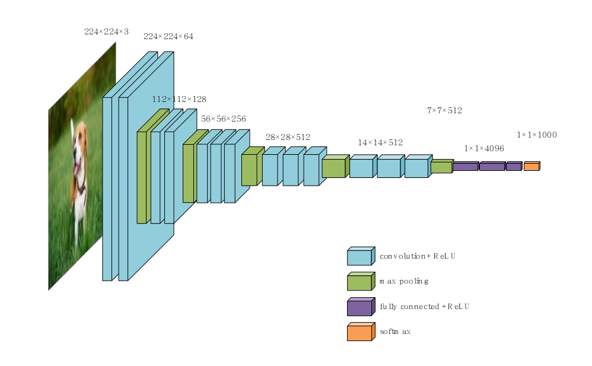

# VGG-16-Study-Notes
# VGG-16网络原理与代码

VGG模型于2014年诞生于Visual Geometry Group 实验室，是ILSVRC 2014的亚军。应用广泛，可以作为如目标检测，实例分割等骨架。通常说的VGG是VGG-16（13层卷积+3层全链接）。最重要superpoint的decoder是以VGG为骨架的！

（接下来均已VGG-16D为例子）

##  VGG-16D网络结构

## VGG-16D的网络特点：

1.VGG的网络结构是分块的，每一个块内的卷积层结构是相同的。每一块的卷积是用来增加特征的，使得通道数上升。每一块的输入输出尺寸是保持一致的。

2.池化操作采用最大池化操作。池化是用来修改特征图的表现，如平滑等等。在池化的过程中，通道数是保持不变的，但特征图的分辨率是缩小的。在VGG-16池化操作将特征图的尺寸缩小了一半。

3.采用较小尺寸的卷积核，在每一块都是3*3。

## 5个VGG BLOCK保持输入输出一致的秘密：

输入与输出特征图之间分辨率的关系：

H，W分别为输入特征图高与宽；OH，OW分别为输出特征图高与宽；FH与FW分别为卷积核或者池化感受野的高与宽；P是输入特征图的填充值；S为卷积核与特征图进行卷积时移动的步长。

在卷积块中卷积核 3*3，保证每一次卷积核与特征图卷积移动的步长为1，输入特征图的填充为2。

在池化块中池化感受野2*2，保证每一次池化与特征图卷积移动的步长为2，输入特征图的填充为0。

## 全链接层的输入:

经过上面的一系列卷积与池化等操作，我们需要对特征图进行展平的操作，将他送入到全链接网络当中，按照网络结构和上面的公式可以计算出输入全连接层的特征图7 * 7 * 512，展平后变成类似于一列25088个参数向量，送入全连接层。

## 全连接层：

共有三层，神经元个数分别是4096，4096，1000。为了防止过拟合，在前两层使用Dropout的操作，随机失活一些神经元。除此之外，在前两层还使用了ReLU。最后一层使用softmax输出1000个分类。

## 输出通道数：

输出通道数只与卷积核的数量有关，和输入的通道数量没有关系。

比如输入（20，20，3）这是一张三通道的图,经过一次卷积生成一个（20，20，64），说明有64个（3，3，3）的卷积核对其进行操作。

## 训练：

权重初始化，以解决训练不收敛。有时添加权重初始化操作也不行，考虑修改batch_size的大小。

